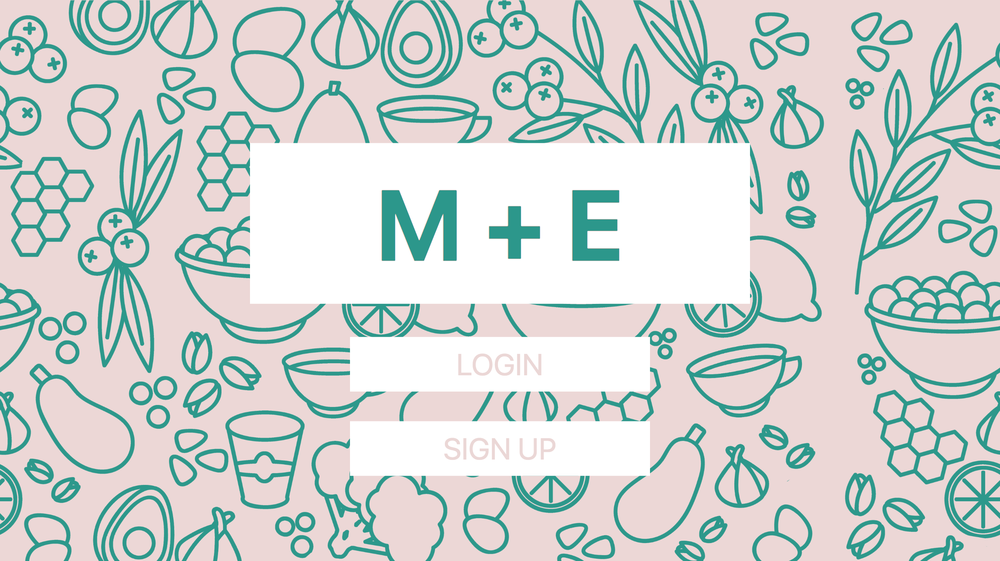
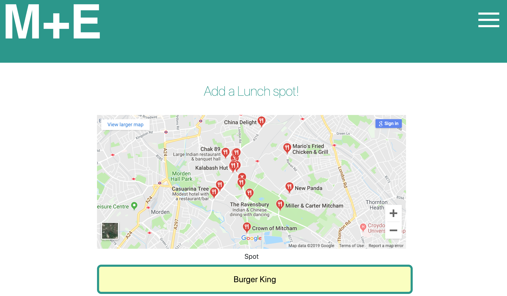
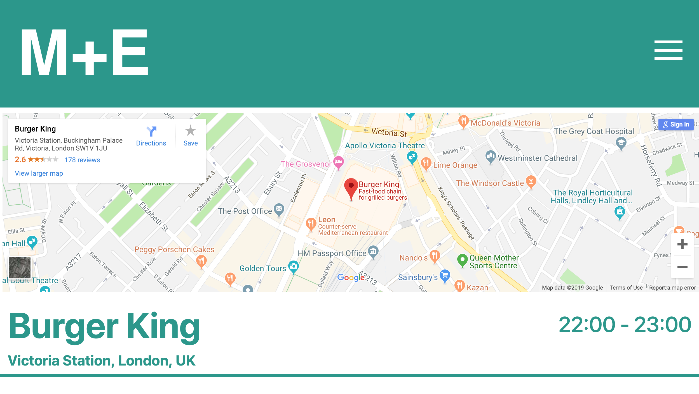
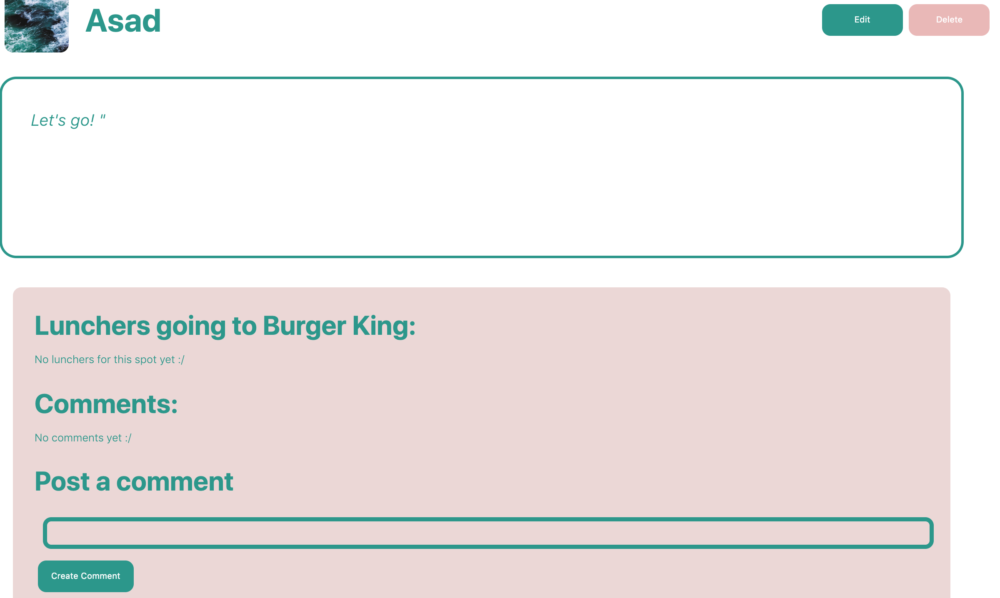
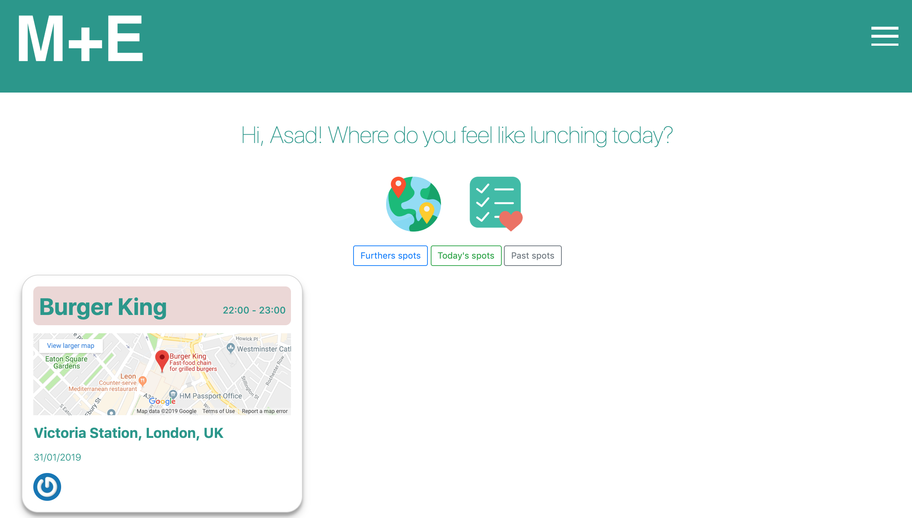
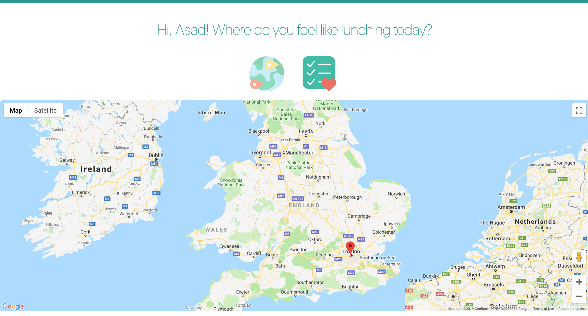
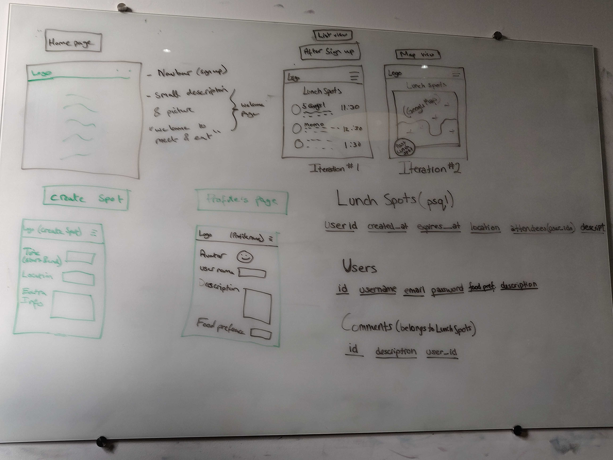

# Meet&Eat

[](https://travis-ci.com/AsadK47/Meet-and-Eat)
[](https://codeclimate.com/github/AsadK47/Meet-and-Eat/maintainability)
[](https://codecov.io/gh/AsadK47/Meet-and-Eat)
[](https://coveralls.io/github/AsadK47/Meet-and-Eat?branch=master)

Welcome to Meet&Eat, the best place to find friends, food and fun.













## Iteration 1.0 Features
:white_check_mark: Users can sign up and sign in to Meet&Eat<br />
:white_check_mark: Users can upload an avatar<br />
:white_check_mark: Users can post a lunch spot with a date, time, location and description<br />
:white_check_mark: Users can only edit or delete their own lunch spots<br />
:white_check_mark: Lunch spots appear on a map with the location marked<br />
:white_check_mark: Users can see all posted lunch spots on the homepage<br />
:white_check_mark: Users have a profile that displays the lunch spots they've posted<br />
:white_check_mark: Users are automatically an attendee of a lunch spot they post<br />
:white_check_mark: Users can join a lunch spot they'd like to attend<br />

## Iteration 2.0 Features
:white_check_mark: Users can leave create, edit and delete comments on a lunch spot <br />
:white_check_mark: Users can choose a dietary preference (ex. vegetarian, pescitarian)<br />
:white_check_mark: Users can change their dietary preference<br />
:white_check_mark: Expired lunch spots are not listed<br />
:white_check_mark: Users can filter lunch spots by time and date<br />
:white_check_mark: Users can filter lunch spots by location<br />

## Iteration 3.0 Features
:white_check_mark: All active lunch spots display on a map<br />
:white_check_mark: All active lunch spots an active date<br />
:white_check_mark: Users can assign themselves interest tags (ex. coding, illustration)<br />
:white_check_mark: Spots can be sorted by past, present and future<br />
:white_check_mark: When typing in location, autofill activates to suggest places<br />

## Links to the application and development board

**Heroku application:** https://meet-andeat.herokuapp.com/

**Trello board:** https://trello.com/b/P43rsW5t/meateat-planning

## Members
- [Asad Khan](https://github.com/AsadK47)
- [Cristopher Palacios](https://github.com/criszelaya24)
- [Mateusz Stacel](https://github.com/mateuszstacel)
- [Jackie Dunne](https://github.com/kiedunne)

## Running the app locally

1. Git fork and clone the repository and cd into the Meet-and-Eat folder
2. Run ```bundle install```
3. Run ```rake db:setup```
4. Run ```bundle exec figaro install``` which will create an application.yml file and this file will be automatically .gitignored.
5. Add your own google maps api key or ask a member of the team to supply you with the dev version by pasting ```google_maps_api_key: xxx``` where the x’s will be replaced by an existing key
6. Run ```rails s``` which will boot up the server on localhost:3000 which you will need to type into a browser address bar
7. Sign up as a new user and add spots as necessary. Get your friends to join and test the app by going for lunch together! Have fun :)

**Testing Instructions**

```
bundle exec rspec # Run the tests to ensure it works
bin/rails server # Start the server at localhost:3000
```

## User Stories

```
As a luncher,
So I can show where I am going,
I would like to be able to add a lunch spot

As a luncher,
So other users can meet up with me,
I would like to show my spot on a main board

As a luncher,
So I can join others at a spot,
I would like to be able to join a spot

As a luncher,
So I can show people my dietary restrictions,
I would like to be able to set my dietary preference upon sign up

As a luncher,
So I can easily view where everyone is going,
I would like all lunch spots to appear on a single map

As a luncher,
So I can customise my profile,
I would like to be able to edit my avatar and dietary preference on the edit user page

As a luncher,
So I can let people know I am attending a spot,
I would like to be able to comment on other lunch spots made by users

As a luncher,
So I know what restrictions other people have,
I would like to be able to see their dietary preference upon joining a spot

As a luncher,
So I can easily enter a spot location,
I would like for it to be able to autofill upon typing
```

## Contributing to the project

If you wish to contribute to the project then please do so by running the code through the rspec tests and the rubocop linter.

We are open to pull requests and would definitely appreciate any comments and feedback that you may have about the project.

Please ensure that the pull request is descriptive and easy to understand so as to minimise the time between the request and merge.

## Deploying to Heroku

**Please follow the instructions set below:**

1. Create an account on Heroku
2. Install the Heroku command line tools by running the following from the command line ```brew install heroku/brew/heroku```
3. Create the heroku application, either on Heroku(https://id.heroku.com/login) or running the following from the command line ```heroku create app-name```
4. Push the app to Heroku via the command line using ```git push heroku master```
5. Create the app database on Heroku via the command line using ```heroku run rake db:migrate```
6. Open the app on Heroku via the command line using ```heroku open```
7. You may need to login via the Heroku command line interface (CLI) at any point: ```heroku login```
8. On the Heroku website, go to your app console and take a look at the deploy options.

**From there, you can connect to GitHub via the Heroku integration. Select the option to automatically deploy the app to Heroku only when the CI build passes.**

## Documentation

Below are some diagrams which we drew up in the initial stages of the application during our daily standup. It helped us to create a basic outline of the project and we used it as a guide to get us up and running.

Furthermore we had created a wiki page to help us document our work (link found below) which would in the show how much we had learned and accomplished throughout the project.

Wiki pages: https://github.com/AsadK47/Meet-and-Eat/wiki

### Diagrams

**Diagram of MVP**



**Diagram of the iterations in development**


